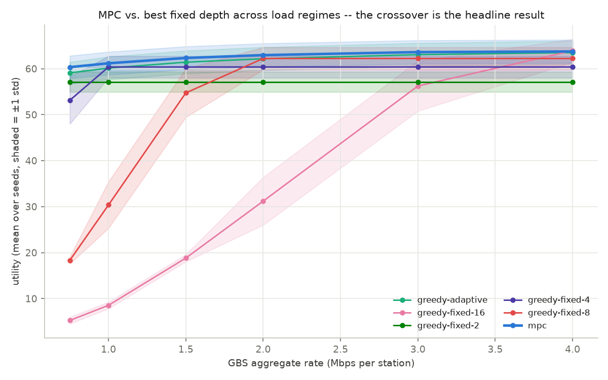
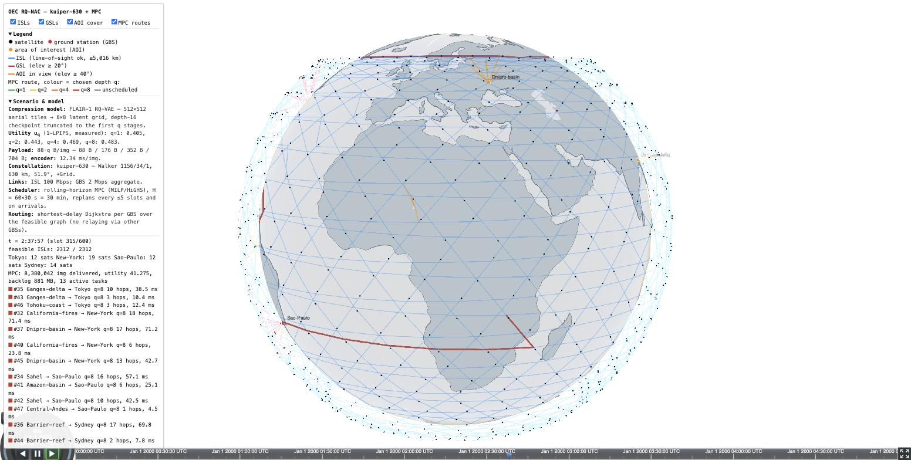

# RQ-VAE Satellite Image Compression for Orbital Edge Computing

Research project evaluating on-board satellite image compression using Residual Quantized Variational Autoencoders (RQ-VAE) under realistic LEO downlink constraints, with LEO network simulation via the Hypatia simulator.

| | |
|---|---|
| Lab | NICE Lab, North Carolina State University |
| Researcher | Hemanth Sudhaharan |
| Graduate Mentor | Xuanhao Luo |
| Faculty Advisor | Dr. Yuchen Liu |
| Server | `eb3-2402-grd04.csc.ncsu.edu` — 2× NVIDIA RTX A6000 |

---

## Project Goal

Evaluate how RQ-VAE compression depth affects reconstruction quality and end-to-end viability under real LEO orbital link constraints (latency, bandwidth, contact windows).

---

## Datasets

| Dataset | Size | Resolution | Use |
|---|---|---|---|
| EuroSAT RGB | 27,000 images, 10 classes | 64×64 | Initial sweep across spatial sizes and depths |
| FLAIR-1 | 77,412 aerial GeoTIFF patches | 512×512 | Main FLAIR training and evaluation |

---

## Results

### EuroSAT — Full Sweep

> Original: `64×64×3×8 = 98,304 bits` | Codebook 2048 → 11 bits/code

| Spatial | Depth | Codes | PSNR (dB) | SSIM | LPIPS | FID | Compression |
|---------|-------|-------|-----------|------|-------|-----|-------------|
| 8×8 | 1 | 64 | 29.93 | 0.7861 | 0.1665 | 19.10 | 139.6:1 |
| 8×8 | 2 | 128 | 31.30 | 0.8273 | 0.1259 | 14.24 | 69.8:1 |
| 8×8 | 3 | 192 | 32.50 | 0.8546 | 0.1037 | 13.43 | 46.5:1 |
| 8×8 | 4 | 256 | 33.28 | 0.8705 | 0.0946 | 14.43 | 34.9:1 |
| **8×8** | **8** | **512** | **36.27** | **0.9362** | **0.0513** | **9.40** | **17.5:1** |
| 4×4 | 1 | 16 | 28.41 | 0.7128 | 0.2294 | 25.46 | 558.5:1 |
| 4×4 | 4 | 64 | 27.93 | 0.7107 | 0.2573 | 34.90 | 139.6:1 |
| 4×4 | 8 | 128 | 23.34 | 0.5634 | 0.3802 | 102.80 | 69.8:1 |
| 2×2 | 1 | 4 | 24.68 | 0.5864 | 0.3477 | 67.20 | 2234.2:1 |
| 2×2 | 8 | 32 | 25.72 | 0.6497 | 0.2985 | 42.35 | 279.3:1 |

`8×8×8` is the best overall. The `4×4` family degrades with depth, likely a latent-grid mismatch at 64×64.

### FLAIR-1 — Subset Training (val split)

> Original: `512×512×3×8 = 6,291,456 bits` | 50% of FLAIR-1 (23,800 train / 7,050 val)

| Model | Payload | PSNR (dB) | SSIM | LPIPS | FID | Compression | Epochs |
|-------|---------|-----------|------|-------|-----|-------------|--------|
| 8×8×1 | 88 B | 20.63 | 0.4560 | 0.4595 | 71.33 | 8,937:1 | 120+ |
| 8×8×8 | 704 B | 21.02 | 0.4643 | 0.4779 | 73.19 | 1,117:1 | 120+ |
| 8×8×16 | 1,408 B | 21.06 | 0.4899 | 0.5039 | 125.78 | 559:1 | 150 |

PSNR and SSIM improve with depth as expected. LPIPS and FID worsen at depth-16 — depth-8 is the best overall checkpoint.

### FLAIR-1 — Depth Truncation Experiment

Tested whether the depth-16 model can be reused at shallower depths by truncating to the first k codebook stages (`evaluate_truncation.py`, `forward_partial_code`).

| Depth-16 truncated to | PSNR (dB) | SSIM | LPIPS | FID |
|---|---|---|---|---|
| 1 stage | 18.67 | 0.4793 | 0.5948 | 225.25 |
| 2 stages | 19.72 | 0.4838 | 0.5570 | 197.76 |
| 4 stages | 20.35 | 0.4831 | 0.5314 | 163.90 |
| 8 stages | 20.73 | 0.4861 | 0.5171 | 143.19 |
| 16 stages | 21.06 | 0.4899 | 0.5039 | 125.78 |

Reuse is not viable. Truncated depth-1 is 2 dB worse in PSNR and 3× worse in FID than the dedicated depth-1 model. Early stages are undertrained in deeper models because they rely on later stages to correct residuals. Dedicated models at each depth are required.

### On-Board Compute Delay (A6000 GPU, 100 runs, 512×512)

| Model | Encode time | Std |
|---|---|---|
| 8×8×1 | 12.34 ms | 0.054 ms |
| 8×8×8 | 12.34 ms | 0.029 ms |

Compute delay is identical across depths — the encoder CNN dominates, not the quantization step.

---

## Satellite Network Simulation — `hypatia_sim/oec_sim/` (current)

Implements the system model and rolling-horizon MPC of the Overleaf
formulation (*OEC RQ-NAC*). Every symbol maps 1:1 to code (`config.py`):

| Formulation | Implementation |
|---|---|
| Satellites S | Kuiper-630 shell 1 — Walker 1156/34/1 (34 planes × 34 sats, 630 km, 51.9°); switchable to `starlink-550` / `telesat-1015` |
| GBSs G | Tokyo, New York, São Paulo, Sydney (Hypatia top-100 city list); GSL feasible at elevation ≥ 20°, 2 Mbps aggregate per GBS |
| Links E_t, C_ij(t) | +Grid ISLs gated per 30 s slot by a line-of-sight test (segment must clear Earth + 80 km atmosphere) and 5,016 km max range; 100 Mbps per ISL. All 2,312 Kuiper +Grid links pass — unlike the legacy small scenario's 120°-apart links, whose chords pass ~2,900 km below the surface (the issue Xuanhao flagged) |
| Tasks K | 8 AOIs (wildfires, Amazon, Sahel, …), imaging at elevation ≥ 40°; 64 tasks / 12.8M images over the window, weights w_k ∈ {1,2,3}, soft deadlines with freshness decay |
| Depths D = {2,4,8,16} | Utilities u_q = 1 − LPIPS_q **measured** from the FLAIR depth-16 model truncated to q stages: 0.443 / 0.469 / 0.483 / 0.496; payload b_q = 88·q B (8×8 latent); encoder 12.34 ms/image |
| Routing | Static: per-slot shortest-delay Dijkstra from each GBS. Predictive (`route_mode='predictive'`, `oec_sim/routing.py`): MPC predicts per-edge congestion from its own plan, Dijkstra re-solves per horizon step, iterated to a damped fixed point (Dr. Liu's directive) |

Window: 5 h (3.1 orbits) at 30 s slots. Run with `python3 -m oec_sim.run_all`
(~25 s; add `--hier --oracle` for the hierarchical scheduler and HiGHS bound,
~1 min). `oec_sim/FORMULATION.md` states all parameters in the Overleaf
notation.

### MPC Scheduler vs. Fixed Depths vs. Hierarchical MPC

The flat scheduler is a deterministic rolling-horizon MPC: HiGHS MILP (via
scipy) over an H = 60-slot (30 min) horizon, executes the first slot,
re-plans on task arrivals and at least every 5 slots — with a timeliness
objective (route-delay-aware freshness + an explicit tardiness penalty, not
just the freshness discount) and an O(H) encoder-pipeline constraint (was
O(H²), a 3-10× MILP speedup). Baselines: greedy with each fixed depth, a
greedy that adapts depth to queue length, and a two-level hierarchical MPC
(`mpc-hier`) that separates slow admission/drop/budget decisions from a fast
per-task depth MILP — see `oec_sim/FORMULATION.md` for the full math.

**Which fixed depth is best depends on load; MPC tracks the upper envelope
without knowing the regime in advance — and is within 0.4% of the offline
HiGHS optimum:**

| scheduler | utility (D={2,4,8,16}, GBS-limited, util≈1.00) | gap to HiGHS bound |
|---|---|---|
| mpc | **64.95**, 95.4% delivered | 0.4% |
| greedy-fixed-8 | 64.15, 100% delivered | 1.6% |
| greedy-adaptive | 64.12, 100% delivered | 1.7% |
| greedy-fixed-4 | 62.25, 100% delivered | 4.5% |
| mpc-hier | 61.4, 95.1% delivered (16 tasks explicitly dropped, not silently starved) | 5.9%, but 4.3× faster to solve |
| greedy-fixed-2 | 58.85, 100% delivered | 9.8% |
| greedy-fixed-16 | 24.43, 87.3% delivered | 62.5% |

Outputs land in `hypatia_sim/oec_scenario/`: per-task outcomes, per-slot
timelines, per-scheduler MILP solve-time logs, the HiGHS upper-bound report
(`--oracle`), `summary.txt`, and `plots/*.png`.

**Delay and violation metrics** (new this pass, in every `task_outcomes_*.csv`
and in `summary.txt`'s "Delay / depth mix" block): per-task completion delay
and lateness, `on-time%` (image-weighted — what fraction of *images* beat
their deadline) and `viol%` (task-weighted — what fraction of *tasks* had
*any* late images, a stricter, complementary reading of the same run), mean
and p95 completion delay, the chosen-depth distribution per scheduler, and
`dropped`/`rejected` counts for schedulers that support giving up on a task.
`delay_cdf.png` plots the completion-delay distribution across schedulers.
What's *not* here yet: these measure timeliness, not whether the delivered
image was actually still useful for its task — see the downstream-metrics
item in Pending.

### Offline Optimality Bound (HiGHS)

`oec_sim/oracle.py` computes two valid upper bounds — dropping ISL/GSL rows
and keeping only the per-window GBS-aggregate budget, which is always a
*relaxation* (it never binds tighter than the true feasible region, since
those rows never bind in the real schedule either — see below):

| bound | value | method |
|---|---|---|
| analytic ceiling | 69.95 | every image at best depth, delivered instantly (sanity check only) |
| LP bound | 65.66 | depth relaxed to continuous, 5-slot windows |
| MILP bound (dual) | 65.22 | full resolution, integral depth, HiGHS, 120 s time limit, 0.1% MIP gap |

**MPC lands at 64.95 — 0.4% off the true optimum.** That's the single
strongest number from this pass: the flat MPC isn't "pretty good," it's
essentially solving the problem optimally in this regime.

### Predicted-Cost Routing (Dr. Liu's directive)

*"MPC and Dijkstra are not necessarily mutually exclusive — have MPC
predict link costs, and Dijkstra compute the path at each predicted step."*
Implemented in `oec_sim/routing.py`: an M/M/1-style congestion penalty on
top of propagation distance, built from the MPC's own predicted load, with
Dijkstra re-solved per horizon step and iterated to a damped fixed point
(`route_mode='predictive'`, scheduler name `mpc-congestion`).

**Verified no-op under the committed `gbs-limited` rates** — an audit found
the per-GBS aggregate budget is ≥12× tighter than any ISL segment a route
could cross, so ISL contention is mathematically unreachable (max measured
ISL utilization ≈0.08) and predicted-cost routing has nothing to act on
(`route_mode='predictive'` reproduces `route_mode='static'` bit-for-bit at
iteration 0). A second scenario, `SCENARIO='fabric-limited'` (`--scenario
fabric-limited --congestion`), rebalances rates so ISL segments can
genuinely saturate; there, predictive routing measurably changes the plan
and utility. Only single-path routing is implemented — multipath candidate
sets are documented future work.

### Hierarchical MPC + the Rotting-Backlog Fix

*"Hierarchical MPC — one MPC to select the best path, another one [for the
rest]."* `oec_sim/hier.py` splits the problem into a slow upper level
(admission control, explicit task abandonment, per-task GBS-budget
allocation, every 10 min) and a fast lower level (today's per-task depth
MILP, but short-horizon and budget-capped, every 5 slots). This also gives
the rotting-backlog problem — a task whose freshness has decayed to ~0
still holds backlog and still generates MILP variables every re-plan, but
is never worth serving, so under the flat scheduler it silently starves
forever — an explicit, reported fix: tasks are either admitted, dropped
(counted), or rejected at arrival (counted), never silently abandoned.

Measured trade-off (see table above): `mpc-hier` gives up ~3.6 utility
points relative to flat MPC (5.9% vs 0.4% gap to the HiGHS bound) in
exchange for **4.3× faster solving** (3.7 s vs 15.8 s total solve time
across the run) and honest accounting of the 16 tasks it explicitly drops.
A small grid search (5 combinations) tuned `PHI_DROP` (0.05→0.01) and
`HIER_THETA_ADMIT` (0.9→0.5), closing about a point of the gap (60.71→61.4
utility) — a first pass, not exhaustive.

### Committed Congestion Sweep



`oec_sim/sweep.py` replaces what used to be a single manual congested run
that was never saved to the repo. Full grid — 6 GBS rates × 5 seeds × 6
schedulers, **180 rows**, committed at `oec_scenario/sweep/results.csv`:

| GBS rate | best fixed depth | best-fixed utility | mpc utility |
|---|---|---|---|
| 0.75 Mbps | depth-2 | 57.08 | **60.34** |
| 1.0 Mbps | depth-4 | 60.38 | **61.18** |
| 1.5 Mbps | depth-4 | 60.38 | **62.34** |
| 2.0 Mbps | depth-8 | 62.22 | **62.96** |
| 3.0 Mbps | depth-8 | 62.22 | **63.61** |
| 4.0 Mbps | depth-16 | 63.92 | 63.76 |

The best *fixed* depth climbs 2→4→8→16 as load falls; `mpc` beats it in 5
of 6 regimes and is statistically tied (within 0.2 utility) at the one
point where there's no scarcity to exploit. No cherry-picking — this is the
mean over all 5 seeds per rate.

### RL Baseline (PPO) — Trained and Evaluated

Dr. Liu asked for an MPC-vs-RL comparison. `oec_sim/rl_env.py` implements a
Gymnasium environment (`Discrete(6)`: commit one of 4 depths, defer, or
drop, decided per active task rather than per slot so the action space is
independent of how many tasks are active or how large the constellation
is). Reward matches the MILP objective plus potential-based backlog
shaping.

**A real bug turned up during this pass and is worth stating plainly**: the
environment had a genuine infinite loop — a task the policy deferred would
get re-offered at the *same simulated time slot* forever instead of moving
on to the next slot, because the "rebuild this slot's queue" check used
empty-list truthiness, which can't tell "just drained, waiting to advance"
apart from "not built yet." A diagnostic run caught it directly: 3,000
consecutive decisions with the simulation clock frozen at slot 420 of 601.
Fixed with an explicit `None` sentinel (`rl_env.py::_advance_to_next_decision`);
a full episode now runs in ~0.2 s instead of hanging indefinitely.

With that fixed, PPO was **trained** (300k timesteps, load regimes 1.5–2.5
Mbps × 10 seeds, ~4 min on a CPU Mac) and **evaluated** in-distribution and
out-of-distribution:

| regime | RL utility | RL delivered% | RL µs/decision | MPC utility | MPC µs/decision |
|---|---|---|---|---|---|
| in-dist (2.0 Mbps) | 58.13 / 52.31 | 100% | ~500–1,400 | 61.58 / 55.55 | ~145,000–243,000 |
| OOD-light (4.0 Mbps) | 58.13 / 52.31 | 100% | ~500–1,400 | 62.44 / 56.14 | ~145,000–243,000 |
| OOD-heavy (0.75 Mbps) | 54.76 / 50.83 | 100% | ~500–700 | 58.92 / 53.27 | ~163,000–173,000 |
| *(two seeds shown per regime: 100 / 101)* | | | | | |

Three findings — two matched what I predicted in advance, one didn't:

1. **PPO loses to MPC on utility, as expected** — 5–8% below MPC everywhere tested.
2. **PPO is ~250–400× faster per decision** (µs vs. hundreds of ms) — the inference-cost story holds up strongly.
3. **Unexpected**: the observation vector has no capacity/congestion feature (task properties + active-count + mean freshness only), so the policy's *actions* are provably rate-independent — utility is bit-for-bit identical between 2.0 and 4.0 Mbps at a fixed seed. It still delivers 100% of images at 0.75 Mbps (where `greedy-fixed-8` collapses to 13–20 utility) purely because it happened to learn conservative depth choices, not because it senses congestion. That's accidental robustness, not adaptive — the clear next step is adding residual-bandwidth features to the observation, which the original design called for but the shipped version dropped for a smaller vector.

### Visualizations



*`satviz_oec.html` at t = 2:38 — 13 active tasks routed to their GBSs (dark
red = MPC chose depth 8), 2,312 feasible ISLs, with the legend, scenario/model
panel, and live MPC stats in the HUD. Screenshot predates this pass's switch
to D={2,4,8,16} (taken under the older {1,2,4,8} depth set); regenerate with
`python3 -m oec_sim.satviz` after a fresh `run_all` to match current depths
(yellow q=2, orange q=4, red q=8, purple q=16).*

Three viewers, all showing the same verified topology (the drawn ISLs, GSLs,
and routes were checked node-for-node against `topology.py`'s routing):

1. **`oec_scenario/satviz_oec.html`** *(main)* — the OEC scenario on the
   Cesium 3D globe in Hypatia's SatViz style. Constellation animated over the
   full 5 h window with a timeline scrubber; per-frame LOS-gated ISLs,
   elevation-gated GSLs, GBS/AOI markers; active MPC tasks drawn as
   shortest-delay routes coloured by the chosen depth (green q=1, yellow q=2,
   orange q=4, dark red q=8); legend, scenario/model panel, and live stats
   HUD (delivered images, utility, backlog) driven by `timeline_mpc.csv`.
   Landmass is embedded (Natural Earth 110m, `oec_sim/land_110m.json`) rather
   than streamed — tile hosts block `file://` pages — so only the Cesium
   library loads from the network. Regenerate: `python3 -m oec_sim.satviz`.
2. **`oec_scenario/viewer.html`** — self-contained 2D canvas simulator
   (play/scrub, ISL/coverage toggles, live stats); fully offline.
3. **Stock Hypatia SatViz** (`hypatia/satviz`, local clone, not tracked) —
   `scripts/visualize_kuiper_630.py` writes `viz_output/kuiper_630.html`,
   the same static snapshot style as Hypatia's README figures (one epoch,
   intra-plane orbit rings only, no ISL model). Needs a free Cesium ion
   token pasted at line 10.

### Small Scenario (legacy, superseded)

`hypatia_sim/small_scenario.py` — an earlier 6-satellite debug scenario,
fully replaced by `oec_sim/`. Its 120°-separation intra-plane ISLs are not
physically feasible (no line of sight — the direct path passes through the
Earth), which is exactly the issue `oec_sim`'s LOS+range gating was built
to fix. Kept in the repo for reference only; not part of the active
results.

---

## Repository Structure

```
.
├── hypatia_sim/
│   ├── oec_sim/                    # OEC scenario + MPC scheduler (current)
│   │   ├── config.py               # All parameters (constellation, links, tasks, depths)
│   │   ├── geometry.py             # Walker propagation, ISL line-of-sight test
│   │   ├── topology.py             # E_t: feasibility-gated links, static geometric routing
│   │   ├── routing.py              # MPC-predicted link costs + per-tau Dijkstra fixed point
│   │   ├── tasks.py                # AOI-triggered task arrivals, drop/reject tracking
│   │   ├── schedulers.py           # MPC (MILP) + greedy baselines; O(H) constraint; timeliness objective
│   │   ├── hier.py                 # Hierarchical MPC (mpc-hier) + rotting-backlog fix
│   │   ├── oracle.py               # Offline HiGHS upper bound (LP + time-limited MILP)
│   │   ├── sweep.py                # Committed congestion sweep across load regimes x seeds
│   │   ├── rl_env.py / rl_train.py # Gymnasium env + PPO baseline (needs a separate RL venv)
│   │   ├── plots.py / viewer.py    # Figures + interactive HTML simulator
│   │   ├── satviz.py               # OEC scenario on the Cesium globe (Hypatia SatViz style)
│   │   ├── land_110m.json          # Embedded Natural Earth landmass for satviz
│   │   └── FORMULATION.md          # Parameters in the Overleaf notation
│   ├── oec_scenario/               # Simulation outputs (CSVs, plots, viewer.html, satviz_oec.html)
│   ├── ppo_oec.zip                 # Trained PPO baseline (MaskablePPO, 300k timesteps)
│   ├── requirements.txt            # Core sim deps (numpy, scipy, matplotlib)
│   ├── requirements-rl.txt         # + RL training deps (gymnasium, sb3-contrib, torch)
│   ├── small_scenario.py           # Legacy 6-sat scenario (infeasible ISLs)
│   ├── topology_config.py          # Full Starlink-550 topology config
│   ├── generate_sim_inputs.py      # UDP burst schedule + ns-3 config
│   ├── extract_topology.py         # ISL degree, serving sats, handoffs, windows
│   ├── analyse_results.py          # Latency, drop rate, ISL utilization
│   ├── profile_compute_delay.py    # On-board encode time profiling
│   ├── TOPOLOGY.md                 # Topology design doc
│   └── small_scenario/             # Simulation outputs
├── rq-vae/
│   ├── evaluate_metrics.py
│   ├── evaluate_truncation.py      # Depth-16 codebook reuse experiment
│   ├── run_flair_8x8_sweep.sh
│   ├── train_eurosat.py
│   └── rqvae/
├── nac/
│   ├── arithmetic_coding.py
│   ├── nac_eurosat.py
│   └── ngram.py
├── results/
└── flair_val_metrics_all.txt
```

---

## Reproducing

### Dependencies

```bash
pip install torch torchvision torchaudio
pip install omegaconf einops lpips tensorboard scikit-image tqdm matplotlib pillow numpy scipy pyyaml
pip install "rasterio<1.5"
```

### FLAIR-1 Training

```bash
cd rq-vae
CUDA_VISIBLE_DEVICES=0 DEPTHS="1 2 4" MAX_TRAIN_SAMPLES=23800 ./run_flair_8x8_sweep.sh
CUDA_VISIBLE_DEVICES=1 DEPTHS="8 16" MAX_TRAIN_SAMPLES=23800 ./run_flair_8x8_sweep.sh
```

### Evaluate Metrics

```bash
python3 evaluate_metrics.py --split val --output-dirs output/flair-rqvae-8x8x1 output/flair-rqvae-8x8x8 output/flair-rqvae-8x8x16
python3 evaluate_truncation.py
```

### Satellite Simulation

```bash
cd hypatia_sim
pip3 install -r requirements.txt      # numpy, scipy (HiGHS MILP), matplotlib
python3 -m oec_sim.run_all                    # ~25 s; outputs in oec_scenario/
python3 -m oec_sim.run_all --hier --oracle    # + hierarchical MPC + HiGHS bound, ~1 min
python3 -m oec_sim.sweep --quick              # committed congestion sweep, smoke test
python3 small_scenario.py             # legacy 6-sat scenario
```

### SatViz (Cesium 3D visualization)

```bash
# OEC scenario on the Cesium globe (animated, ISLs/GSLs/MPC overlay):
cd hypatia_sim
python3 -m oec_sim.satviz             # writes oec_scenario/satviz_oec.html

# stock Hypatia static snapshot:
cd hypatia/satviz/scripts
pip3 install ephem
python3 visualize_kuiper_630.py       # writes ../viz_output/kuiper_630.html
# paste your Cesium ion token (free, cesium.com/ion) at line 10 of the
# generated HTML, then open it in a browser
```

---

## Pending

**OEC network simulation:**

1. Add residual-bandwidth/congestion features to the PPO observation (`rl_env.py::_obs()`) — the trained policy's actions are currently rate-independent (see RL section above), which is the main lever left to close its 5–8% utility gap to MPC
2. `mpc-hier`'s admission/drop/backpressure thresholds were tuned once (`HIER_THETA_ADMIT` 0.9→0.5, `PHI_DROP` 0.05→0.01, closing ~1 utility point) but not exhaustively — still trades ~5.9% utility for 3.7× faster solves
3. `satviz.py` route replay (`routes_mpc.csv`) so the Cesium viewer's client-side Dijkstra matches predictive/hierarchical routing instead of only the static router
4. Robust/stochastic MPC variants (forecast uncertainty), per-GBS antenna constraints
5. Train PPO on the full protocol (100 seeds, `starlink-550` OOD-topology transfer) on the NCSU server — this pass used a reduced local run (30 training seeds, 2 eval seeds/regime) to fit a CPU laptop

**RQ-VAE compression:**

6. Complete FLAIR-1 dedicated-model sweep for depths 2 and 4 (truncation eval already covers 1/2/4/8/16)
7. Evaluate downstream-task metrics (mIoU / F1) on reconstructed images and replace the reconstruction-based utility mapping u_q in `oec_sim/config.py` — still the biggest lever on how much the depth choice can matter, since u_q currently spans only +12% (q=2→16) against an 8× payload spread
8. Run NAC entropy coding on exported FLAIR codes
9. Run ns-3 end-to-end simulation (full Starlink scenario, ns-3 build unblocked)

---

## References

- RQ-VAE: "Residual Quantized Variational Autoencoders", CVPR 2023
- EuroSAT: https://github.com/phelber/eurosat
- FLAIR-1: https://github.com/IGNF/FLAIR-1
- Hypatia: https://github.com/snkas/hypatia

## Contact

Hemanth Sudhaharan — NICE Lab, NC State University — hsudhah@ncsu.edu
